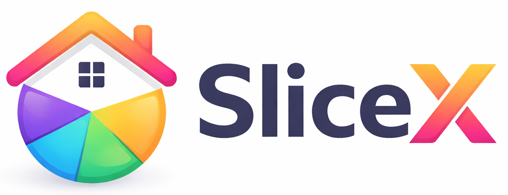

---

# The Slice X
## AI Powered Verified land market place

---


## 🏡 The Slice X — Trusted LanDiscovery, Reimagined

**The Slice X** is a premium, map-enabled land marketplace designed to help buyers discover, compare, and contact property owners with confidence.
Built with a modern, mobile-first approach, it blends **list-based browsing** with a powerful **interactive map experience**.

---

## 🎡 Hero Preview — Enhanced Pagination Experience

> A smooth, wheel-like pagination scroller designed for fast and delightful browsing.


---



---

## 🌐 Website

👉 **Live:** [https://www.theslicex.com](https://www.theslicex.com)

---

## 📌 Core Features

### 1. Smart Property Search & Filters

* Filter by **state, district, mandal, village**
* Keyword-based search across listings
* Unified filters across **Home View** and **Map View**
* Clean, fast, and responsive UI

---

### 2. Property Listings (Home View)

* High-quality land images
* Price formatting in **₹ Lakhs / Crores**
* Area and unit details clearly visible
* One-click contact via **WhatsApp or phone**
* Designed to build trust and clarity


---

### 3. 🗺️ Interactive Map View (Mapbox)

* Discover properties visually using Mapbox
* Click map markers to view land details
* Seamless navigation between **Map View** and **Listings View**
* Uses the same filters and search logic for consistency
* Ideal for location-first property exploration

**Preview:**


---

### 4. Advanced Pagination System

* Smooth horizontal, wheel-style pagination
* Center-focused active page indicator
* Optimized for large datasets
* Shared pagination logic across views

*(Featured above as the hero animation)*

---

### 5. Mobile-First & Responsive Design

* Fully optimized for mobile and tablets
* Touch-friendly interactions
* Clean typography with balanced contrast
* Fast load times and smooth animations


---

## 🛠 Tech Stack

| Layer      | Technology                        |
| ---------- | --------------------------------- |
| Frontend   | Next.js 13 (App Router), React 18 |
| Styling    | Tailwind CSS                      |
| Icons      | React Icons, Lucide React         |
| Backend    | Supabase (DB, Auth, Storage)      |
| Maps       | **Mapbox GL JS**                  |
| Deployment | Vercel                            |

---

## 📂 Project Structure

```text
frontend/
├─ app/
│  ├─ page.tsx              # Home listings
│  ├─ map-view/
│  │  └─ page.tsx           # Mapbox-powered map view
│  ├─ layout.tsx
│  └─ globals.css
├─ components/
│  ├─ Header.tsx
│  ├─ Footer.tsx
│  ├─ Filters.tsx
│  ├─ PaginationScroller.tsx
│  ├─ MapView.tsx
│  └─ ContactReveal.tsx
├─ lib/
│  └─ supabaseClient.ts
├─ public/
│  ├─ logo.png
│  ├─ favicon.png
│  ├─ gifs/
│  │  ├─ enhanced-pagination.gif
│  │  └─ map-view.gif  
├─ package.json
└─ README.md
```

---

## ⚡ Installation

```bash
git clone https://github.com/srinugalla/the-slice-x.git
cd the-slice-x/frontend
npm install
```

### Environment Variables

```env
NEXT_PUBLIC_SUPABASE_URL=your_supabase_url
NEXT_PUBLIC_SUPABASE_ANON_KEY=your_supabase_anon_key
NEXT_PUBLIC_MAPBOX_TOKEN=your_mapbox_access_token
```

Run locally:

```bash
npm run dev
```

Open 👉 `http://localhost:3000`

---

## 🚀 Deployment

Optimized for **Vercel**:

```bash
vercel
```

---

## 🎨 Design Principles

* Trust-first UI for real estate
* Minimal yet premium look
* Location-driven discovery
* Smooth animations without distraction

Inspired by:

* [FullScale.ie](https://fullscale.ie)
* Modern real-estate and map-based platforms

---

## 📞 Contact

* **Email:** [support@theslicex.com](mailto:support@theslicex.com)
* **Website:** [https://www.theslicex.com](https://www.theslicex.com)

---

## 🧭 Roadmap

* Saved searches & alerts
* User dashboards
* Favorite properties
* Advanced map filters (radius, price range)
* Dark mode
* Verified seller badges

---

## ⚖️ License

MIT License © 2026
**The Slice X — Trusted land discovery, reimagined.**

---
